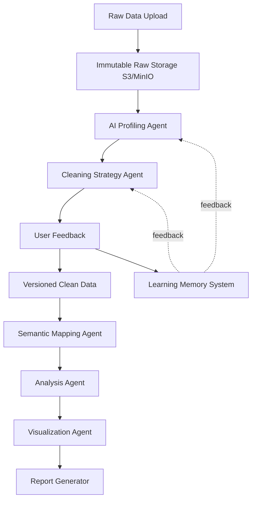
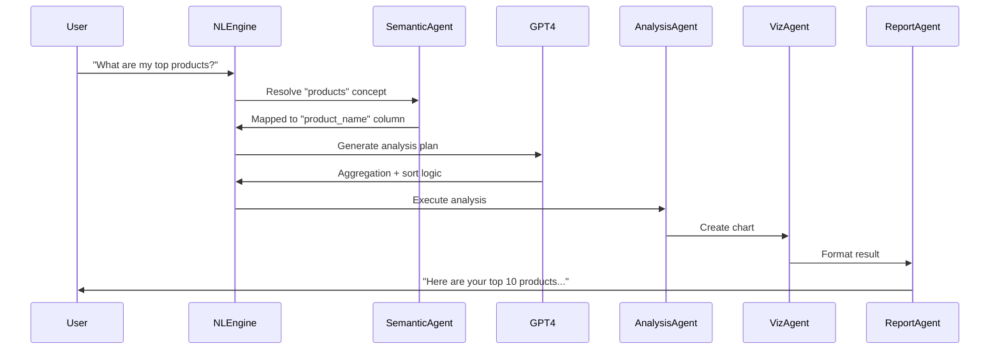
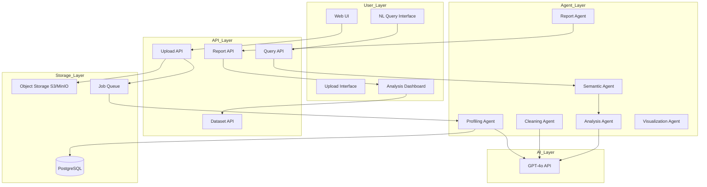

# AI Data Analyst Platform - Complete Implementation Plan

## Vision Statement

**"Upload Any Data → AI Understands → Cleans → Analyzes → Reports"**Transform from a BI query tool into an AI Data Analyst that thinks like a human consultant. No SQL. No schema. No configuration.

## Architecture Philosophy




## Core Principles

1. **Raw Data is Sacred** - Never reject, never destroy
2. **Understanding > Cleaning > Analysis** - AI comprehends before acting
3. **Semantic Layer > Schema** - Business meaning over database types
4. **Human Analyst Thinking** - Consultant behavior, not parser logic

## Phase 1: Foundation & Core Agents (Weeks 1-4)

### 1.1 Data Storage Architecture

**File: `lib/storage/raw-storage.ts`**Implement immutable raw data storage:

- Stream large files to object storage (MinIO for local dev, S3 for production)
- Store metadata in PostgreSQL
- Never transform on upload
- Handle any file format (CSV, Excel, JSON, SQL dumps)

**Database Schema Updates:**

```typescript
// New models in schema.prisma
model Dataset {
  id              String   @id @default(uuid())
  userId          String
  name            String
  originalFileName String
  rawFileLocation  String   // s3://bucket/raw/dataset_123.csv
  fileSize        BigInt
  uploadedAt      DateTime @default(now())
  status          DatasetStatus @default(UPLOADED)
  
  user            User     @relation(fields: [userId], references: [id])
  versions        DatasetVersion[]
  profile         DataProfile?
  analyses        Analysis[]
}

model DatasetVersion {
  id              String   @id @default(uuid())
  datasetId       String
  versionNumber   Int      // 0=raw, 1=clean_v1, 2=clean_v2
  versionType     VersionType // RAW, CLEANED, USER_MODIFIED
  fileLocation    String
  cleaningActions Json?    // What transformations were applied
  createdAt       DateTime @default(now())
  
  dataset         Dataset  @relation(fields: [datasetId], references: [id])
}

model DataProfile {
  id              String   @id @default(uuid())
  datasetId       String   @unique
  domain          String   // "sales", "healthcare", "logs"
  mainEntity      String   // "transaction", "claim", "order"
  timeColumn      String?
  metrics         Json     // ["revenue", "cost"]
  dimensions      Json     // ["city", "category"]
  dataQualityScore Float
  issues          Json     // Detected problems
  confidence      Float
  profiledAt      DateTime @default(now())
  
  dataset         Dataset  @relation(fields: [datasetId], references: [id])
}

enum DatasetStatus {
  UPLOADED
  PROFILING
  PROFILED
  CLEANING_SUGGESTED
  CLEANED
  ANALYZED
  READY
  ERROR
}

enum VersionType {
  RAW
  CLEANED
  USER_MODIFIED
}
```

**File: `lib/storage/object-storage.ts`**MinIO/S3 client wrapper:

```typescript
class ObjectStorage {
  async uploadRaw(file: Buffer, datasetId: string): Promise<string>
  async downloadRaw(location: string): Promise<Stream>
  async createVersion(datasetId: string, versionNum: number, data: Buffer): Promise<string>
  async streamLargeFile(location: string): AsyncIterable<Buffer>
}
```


### 1.2 Agent 1: AI Profiling Agent

**File: `lib/agents/profiling-agent.ts`**This is the brain - understands what the data means.**Responsibilities:**

- Sample random rows (not full dataset)
- Detect business domain using GPT-4o
- Identify metrics vs dimensions
- Find time axis
- Calculate data quality score
- Detect issues (missing values, format inconsistencies, outliers)

**Implementation Strategy:**

```typescript
class ProfilingAgent {
  async profile(datasetId: string): Promise<DataProfile> {
    // 1. Sample data (first 100 rows + random 100)
    const sample = await this.sampleDataset(datasetId)
    
    // 2. Build comprehensive prompt
    const prompt = this.buildProfilingPrompt(sample)
    
    // 3. Call GPT-4o with structured output
    const aiResponse = await openai.chat.completions.create({
      model: "gpt-4o",
      response_format: { type: "json_object" },
      messages: [{
        role: "system",
        content: PROFILING_SYSTEM_PROMPT
      }, {
        role: "user",
        content: prompt
      }]
    })
    
    // 4. Parse and validate
    // 5. Store profile
    // 6. Return insights
  }
}
```

**Prompt Engineering:**

```typescript
const PROFILING_SYSTEM_PROMPT = `You are an expert data analyst profiling a dataset.

Analyze the sample data and provide:
1. Business domain (sales/finance/healthcare/operations/logs/etc)
2. Main entity (what each row represents)
3. Time column (if exists)
4. Metrics (numeric columns representing measurements)
5. Dimensions (categorical columns for grouping)
6. Data quality issues
7. Confidence score (0-1)

Think like a human analyst:
- Consider column names AND values
- Look for business patterns
- Identify relationships
- Note anomalies

Return valid JSON only.`
```


### 1.3 Agent 2: Cleaning Strategy Agent

**File: `lib/agents/cleaning-agent.ts`**Suggests cleaning, never auto-cleans.**Responsibilities:**

- Generate human-readable cleaning plan
- Provide multiple options
- Explain impact of each action
- Allow user approval/modification

**Data Model:**

```typescript
model CleaningPlan {
  id              String   @id @default(uuid())
  datasetId       String
  suggestedActions Json    // Array of cleaning steps
  userApproved    Boolean  @default(false)
  appliedAt       DateTime?
  resultingVersionId String?
  
  dataset         Dataset  @relation(fields: [datasetId], references: [id])
}
```

**Cleaning Actions Schema:**

```typescript
interface CleaningAction {
  type: 'normalize_date' | 'remove_currency' | 'fill_missing' | 'remove_duplicates' | 'cast_type'
  column: string
  description: string // Human explanation
  impact: string // "Affects 14% of rows"
  options?: {
    label: string
    method: string
    recommended: boolean
  }[]
}
```

**Example Output:**

```json
{
  "summary": "Found 3 data quality issues requiring attention",
  "actions": [
    {
      "type": "fill_missing",
      "column": "order_amount",
      "description": "14% of rows have missing order_amount values",
      "impact": "Affects 142 out of 1000 rows",
      "options": [
        {"label": "Fill with median value", "method": "median", "recommended": true},
        {"label": "Fill with zero", "method": "zero", "recommended": false},
        {"label": "Remove affected rows", "method": "drop", "recommended": false}
      ]
    }
  ]
}
```


### 1.4 Data Versioning System

**File: `lib/versioning/version-manager.ts`**Every cleaning creates a new version:

```typescript
class VersionManager {
  async createVersion(
    datasetId: string,
    type: VersionType,
    cleaningActions: CleaningAction[]
  ): Promise<DatasetVersion> {
    // 1. Load previous version
    // 2. Apply transformations
    // 3. Store new version in object storage
    // 4. Create version record
    // 5. Update dataset status
  }
  
  async rollback(datasetId: string, targetVersion: number): Promise<void>
  
  async getVersionHistory(datasetId: string): Promise<DatasetVersion[]>
}
```


## Phase 2: Semantic Layer & Analysis (Weeks 5-8)

### 2.1 Agent 3: Semantic Mapping Agent

**File: `lib/agents/semantic-agent.ts`**Maps columns to business concepts, killing schema rigidity.**Database Schema:**

```typescript
model SemanticMapping {
  id              String   @id @default(uuid())
  datasetId       String
  concept         String   // "revenue", "date", "location", "customer"
  mappedColumns   Json     // ["amount", "total", "price"]
  confidence      Float
  userConfirmed   Boolean  @default(false)
  
  dataset         Dataset  @relation(fields: [datasetId], references: [id])
}
```

**Example Mapping:**

```json
{
  "revenue": {
    "columns": ["amount", "total", "order_value"],
    "confidence": 0.92
  },
  "date": {
    "columns": ["order_date", "created_at", "timestamp"],
    "confidence": 0.95
  },
  "location": {
    "columns": ["city", "region", "state"],
    "confidence": 0.88
  }
}
```

**Why This Matters:**User asks: "Show me revenue trends"System translates: "SUM(amount) GROUP BY DATE(order_date)"Even if columns are named weirdly.

### 2.2 Agent 4: Analysis Agent

**File: `lib/agents/analysis-agent.ts`**Thinks like a business consultant.**Auto-Generated Analyses:**

1. **Summary Statistics**

- Row count, date range, key metrics

2. **Trend Detection**

- Month-over-month growth
- Seasonality patterns
- Sudden changes

3. **Top Contributors**

- Top 10 by revenue
- Geographic distribution
- Category breakdown

4. **Anomaly Detection**

- Outliers
- Missing data patterns
- Sudden drops/spikes

5. **Risk Indicators**

- Data quality risks
- Business risks (declining metrics)

**Database Schema:**

```typescript
model Analysis {
  id              String   @id @default(uuid())
  datasetId       String
  type            AnalysisType
  title           String
  summary         String   // Human-readable summary
  insights        Json     // Structured insights
  visualizations  Json     // Chart configs
  confidence      Float
  generatedAt     DateTime @default(now())
  
  dataset         Dataset  @relation(fields: [datasetId], references: [id])
}

enum AnalysisType {
  SUMMARY
  TREND
  COMPARISON
  ANOMALY
  FORECAST
}
```

**Example Analysis Output:**

```json
{
  "type": "TREND",
  "title": "Revenue Trend Analysis",
  "summary": "Revenue increased 21% month-over-month from September to October. Chennai contributes 38% of total sales. High volatility detected in October with a concerning drop on Oct 12.",
  "insights": [
    {
      "category": "growth",
      "text": "Revenue increased 21% MoM",
      "confidence": 0.94,
      "supporting_data": {"sep": 125000, "oct": 151250}
    },
    {
      "category": "risk",
      "text": "Sudden drop on Oct 12 may indicate missing data",
      "confidence": 0.78,
      "supporting_data": {"date": "2024-10-12", "expected": 8500, "actual": 1200}
    }
  ],
  "visualizations": [
    {
      "type": "line",
      "title": "Monthly Revenue Trend",
      "x_axis": "month",
      "y_axis": "total_revenue",
      "data": [...]
    }
  ]
}
```


### 2.3 Agent 5: Visualization Agent

**File: `lib/agents/visualization-agent.ts`**AI decides chart type and configuration.**Decision Rules:**

- Time series data → Line chart
- Category comparison → Bar chart
- Part-to-whole → Pie chart
- Distribution → Histogram
- Correlation → Scatter plot

**Output Schema:**

```typescript
interface VisualizationConfig {
  type: 'line' | 'bar' | 'pie' | 'scatter' | 'histogram' | 'area'
  title: string
  xAxis: {
    column: string
    label: string
    type: 'temporal' | 'categorical' | 'numeric'
  }
  yAxis: {
    columns: string[]
    label: string
    aggregation: 'sum' | 'avg' | 'count' | 'min' | 'max'
  }
  filters?: {
    column: string
    value: any
  }[]
  explanation: string // Why this chart type
}
```


### 2.4 Agent 6: Report Generation Agent

**File: `lib/agents/report-agent.ts`**Creates human-readable reports with explanations.**Report Structure:**

```typescript
interface GeneratedReport {
  title: string
  executive_summary: string
  key_findings: {
    title: string
    description: string
    chart?: VisualizationConfig
    severity: 'info' | 'warning' | 'critical'
  }[]
  detailed_analysis: {
    section: string
    content: string
    supporting_charts: VisualizationConfig[]
  }[]
  recommendations: string[]
  metadata: {
    dataset_name: string
    rows_analyzed: number
    date_range: string
    generated_at: Date
  }
}
```

**Example Report:**

```markdown
# Sales Data Analysis Report

## Executive Summary
Revenue increased 21% month-over-month, driven primarily by growth in Chennai market. However, data quality issues pose a 6% risk to accuracy.

## Key Findings

### 1. Strong Revenue Growth
Revenue peaked in November due to seasonal demand, reaching ₹1.8M.
[Line Chart: Monthly Revenue Trend]

### 2. Geographic Concentration
Chennai contributes 38% of total sales, indicating regional dependency.
[Pie Chart: Revenue by City]

### 3. Data Quality Risk ⚠️
Sudden drop on Oct 12 suggests 14% data loss. Recommend investigation.
[Bar Chart: Daily Transaction Volume]

## Recommendations
- Diversify geographic revenue sources
- Investigate Oct 12 data anomaly
- Implement data validation at source
```


## Phase 3: Natural Language Queries & Learning (Weeks 9-12)

### 3.1 Natural Language Query System

**File: `lib/query/nl-query-engine.ts`**User asks questions in plain English, system generates insights.**Flow:**



**Database Schema:**

```typescript
model Query {
  id              String   @id @default(uuid())
  datasetId       String
  userId          String
  naturalLanguage String   // "Show revenue by month"
  interpretation  Json     // How AI understood it
  resultAnalysisId String?
  executedAt      DateTime @default(now())
  
  dataset         Dataset  @relation(fields: [datasetId], references: [id])
  user            User     @relation(fields: [userId], references: [id])
}
```


### 3.2 Learning Memory System

**File: `lib/learning/memory-system.ts`**Stores user behavior to improve future decisions.**Database Schema:**

```typescript
model UserMemory {
  id              String   @id @default(uuid())
  userId          String
  memoryType      MemoryType
  context         Json     // What happened
  action          Json     // What user did
  learnedAt       DateTime @default(now())
  
  user            User     @relation(fields: [userId], references: [id])
}

enum MemoryType {
  CLEANING_PREFERENCE
  COLUMN_RENAME
  REJECTED_SUGGESTION
  ACCEPTED_SUGGESTION
  SEMANTIC_MAPPING
  QUERY_PATTERN
}
```

**Learning Examples:**

```json
{
  "type": "CLEANING_PREFERENCE",
  "context": {
    "issue": "missing_values",
    "column_type": "numeric",
    "percentage": 15
  },
  "action": {
    "chosen_method": "median",
    "rejected_methods": ["zero", "drop"]
  }
}
```

**Usage:**Next time user uploads similar data:"Based on your previous preferences, we'll fill missing numeric values with median."

### 3.3 Multi-Dataset Operations

**File: `lib/datasets/multi-dataset-manager.ts`**Allow joining insights from multiple datasets.**Database Schema:**

```typescript
model DatasetRelationship {
  id              String   @id @default(uuid())
  dataset1Id      String
  dataset2Id      String
  joinKey1        String   // Column in dataset1
  joinKey2        String   // Column in dataset2
  relationshipType RelationType
  confidence      Float
  userConfirmed   Boolean  @default(false)
  
  dataset1        Dataset  @relation("Dataset1", fields: [dataset1Id], references: [id])
  dataset2        Dataset  @relation("Dataset2", fields: [dataset2Id], references: [id])
}

enum RelationType {
  ONE_TO_ONE
  ONE_TO_MANY
  MANY_TO_MANY
}
```


## Frontend Implementation (Weeks 4-12, Parallel)

### New Page Structure

```javascript
app/
├── (auth)/ - Keep existing login/signup
├── analyst/
│   ├── layout.tsx
│   ├── page.tsx - New main dashboard
│   ├── upload/
│   │   └── page.tsx - Drag & drop upload
│   ├── datasets/
│   │   ├── page.tsx - List all datasets
│   │   └── [id]/
│   │       ├── page.tsx - Dataset overview
│   │       ├── profile/page.tsx - AI profile results
│   │       ├── cleaning/page.tsx - Cleaning suggestions
│   │       ├── analysis/page.tsx - Auto-generated insights
│   │       └── query/page.tsx - Natural language queries
│   └── reports/
│       ├── page.tsx - Generated reports
│       └── [id]/page.tsx - Report viewer
```


### Key UI Components

**Component: `components/analyst/upload-zone.tsx`**

- Large drag-and-drop area
- "Upload ANY data - we'll figure it out"
- Progress indicator with streaming
- No schema requirements shown

**Component: `components/analyst/profile-viewer.tsx`**

- Shows AI understanding of data
- Domain detection
- Metrics vs dimensions
- Data quality score
- Issues found

**Component: `components/analyst/cleaning-approval.tsx`**

- Human-readable cleaning plan
- Option selection
- Impact preview
- Approve/Modify/Reject buttons

**Component: `components/analyst/insight-card.tsx`**

- Auto-generated insight
- Chart visualization
- Explanation text
- Confidence indicator

**Component: `components/analyst/nl-query-box.tsx`**

- Google-like search box
- Suggestions based on data
- Real-time results
- No SQL shown

## API Routes Architecture

```javascript
app/api/
├── analyst/
│   ├── upload/route.ts - Stream upload to object storage
│   ├── datasets/
│   │   ├── route.ts - List datasets
│   │   ├── [id]/route.ts - Get dataset details
│   │   ├── [id]/profile/route.ts - Trigger profiling
│   │   ├── [id]/cleaning/route.ts - Get/apply cleaning plan
│   │   ├── [id]/versions/route.ts - Version management
│   │   └── [id]/analyze/route.ts - Run analysis agent
│   ├── query/
│   │   └── nl/route.ts - Natural language query
│   └── reports/
│       ├── generate/route.ts - Create report
│       └── export/route.ts - Export PDF/PPT
```


## Infrastructure Requirements

### 1. Object Storage Setup

**Development:**

```bash
# Run MinIO locally
docker run -p 9000:9000 -p 9001:9001 \
  -e "MINIO_ROOT_USER=admin" \
  -e "MINIO_ROOT_PASSWORD=password" \
  minio/minio server /data --console-address ":9001"
```

**Production:**

- AWS S3 or GCS
- CDN for fast access
- Lifecycle policies for old versions

### 2. Environment Variables

```env
# Existing
DATABASE_URL=
OPENAI_API_KEY=
JWT_SECRET=

# New
OBJECT_STORAGE_ENDPOINT=
OBJECT_STORAGE_ACCESS_KEY=
OBJECT_STORAGE_SECRET_KEY=
OBJECT_STORAGE_BUCKET=
OBJECT_STORAGE_REGION=

# Optional
MAX_FILE_SIZE_MB=500
SAMPLE_SIZE_ROWS=200
AGENT_TIMEOUT_SECONDS=30
```


### 3. Background Jobs

Use Bull/BullMQ for async processing:**File: `lib/jobs/profiling-job.ts`**

```typescript
export async function queueProfilingJob(datasetId: string) {
  await profilingQueue.add('profile', { datasetId }, {
    attempts: 3,
    backoff: { type: 'exponential', delay: 2000 }
  })
}
```

**Jobs:**

- Dataset profiling (3-5 minutes)
- Cleaning application (1-2 minutes)
- Analysis generation (5-10 minutes)
- Report generation (2-3 minutes)

## Migration Strategy

### Week 1: Parallel Systems

- Keep existing [`app/dashboard/`](app/dashboard/) functional
- Build new [`app/analyst/`](app/analyst/) separately
- Share auth system
- Separate databases (add new tables)

### Week 8: Feature Parity

- New system has all core features
- User testing phase
- Bug fixes

### Week 12: Deprecation

- Redirect [`/dashboard`](app/dashboard/) to [`/analyst`](app/analyst/)
- Archive old code
- Clean up unused APIs

## Success Metrics

**Technical:**

- Upload success rate > 99%
- Profiling accuracy > 85%
- Analysis generation < 30 seconds
- Zero data loss

**User Experience:**

- Time to first insight < 3 minutes
- User satisfaction > 4.5/5
- Return usage > 70%
- Zero SQL exposure

## Risk Mitigation

**Risk 1: AI Hallucination**

- Solution: Confidence scores, human review, conservative defaults

**Risk 2: Large File Performance**

- Solution: Streaming, sampling, background jobs

**Risk 3: Cost (OpenAI API)**

- Solution: Caching, smart sampling, rate limiting

**Risk 4: Data Security**

- Solution: Encryption at rest, access controls, audit logs

## Deliverables Summary

### Phase 1 (Weeks 1-4)

- [ ] Raw data storage system
- [ ] Object storage integration
- [ ] Profiling Agent
- [ ] Cleaning Strategy Agent
- [ ] Versioning system
- [ ] Basic upload UI
- [ ] Profile viewer UI

### Phase 2 (Weeks 5-8)

- [ ] Semantic mapping agent
- [ ] Analysis agent
- [ ] Visualization agent
- [ ] Report generation agent
- [ ] Analysis dashboard UI
- [ ] Report viewer UI

### Phase 3 (Weeks 9-12)

- [ ] Natural language query engine
- [ ] Learning memory system
- [ ] Multi-dataset joins
- [ ] Export functionality (PDF/PPT)
- [ ] Advanced analytics UI
- [ ] Production deployment

## Technology Additions

**New Dependencies:**

```json
{
  "dependencies": {
    "@aws-sdk/client-s3": "^3.478.0",
    "bull": "^4.12.0",
    "pdf-lib": "^1.17.1",
    "pptxgenjs": "^3.12.0",
    "fast-csv": "^5.0.0",
    "streaming-iterables": "^7.1.0"
  }
}
```


## Final Architecture Diagram




## Positioning & Marketing

**Product Name:** AI Data Analyst Platform (or "Cortex AI Analyst")**Tagline:** "Upload Your Data. We Think Like Your Analyst."**Key Differentiators:**

1. Zero configuration required
2. Handles messy data gracefully
3. Explains everything in human language
4. Learns from user preferences
5. No SQL exposure ever

**Target Users:**

- Business analysts without technical skills
- Small business owners